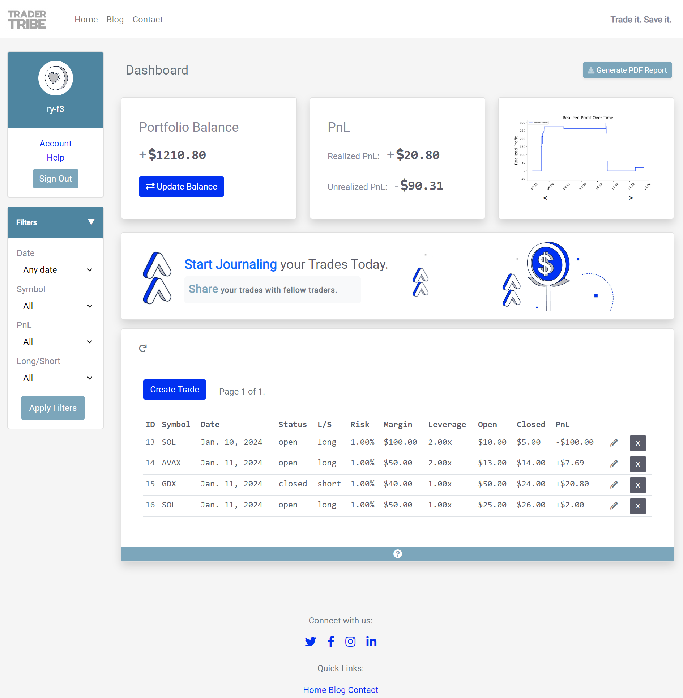

# Trader Tribe 

# Code Institute Portfolio Project 4: Django Full-Stack Toolkit -  deployed via Github.
### To view the project please [click here](https://trader-tribe-7c9dc3cf075d.herokuapp.com/).
 

*Please be aware: for reasons beyond my understanding, the "I Am Responsive" tool is not displaying my application.*

 

## **Scope**

Trader Tribe is a specialised trading journal app meticulously crafted to meet the distinct requirements of traders within a niche market. The app offers users a dynamic platform to journal their trades with ease, equipped with robust tools for meticulous tracking of profits and losses. More than just a personal tracking tool, Trader Tribe cultivates a vibrant community space where users can share their unique trading experiences with fellow enthusiasts.

Key Features
1. **Dynamic Trade Journaling:**
Seamlessly record and document trade details, including symbols, dates, position sizes, margins, leverage, and more.
The dynamic row system ensures a personalised and organised trade journal tailored to each user.
2. **Profit and Loss Tracking:**
Real-time monitoring of profits and losses associated with each trade, providing valuable insights into overall portfolio performance.
3. **Community Engagement:**
Create a collaborative atmosphere where users can share insights, strategies, and the highs and lows of their trading journey.
Explore and learn from the experiences of other users within the Trader Tribe community.
4. **User-Friendly Interface:**
Intuitive and user-friendly design makes Trader Tribe accessible to traders of all levels of expertise.

## **Audience**

Trader Tribe caters to a diverse audience of traders seeking a comprehensive tool to enhance their trading experience. Our target audience includes traders from various backgrounds and styles, each with unique needs and preferences.

### **Types of Traders**

* Day Traders:
    * Description: Engage in buying and selling within the same day.
    * Characteristics: Quick decision-makers, monitor intraday charts, execute multiple trades.
    * Needs: Real-time market data, fast execution platforms, risk management tools.
* Swing Traders:
    * Description: Hold positions for days to weeks to capture price swings.
    * Characteristics: Analyse technical and fundamental factors, moderate trading frequency.
    * Needs: Charting tools, trend analysis, risk-reward calculators.
* Position Traders:
    * Description: Take a long-term investment approach, holding for weeks, months, or years.
    * Characteristics: Focus on fundamental analysis, less concerned with short-term fluctuations.
    * Needs: Fundamental data, macroeconomic indicators, portfolio management tools.
* Scalpers:
    * Description: Make numerous short-term trades to profit from small price movements.
    * Characteristics: Execute high-frequency trades, use technical indicators for entry and exit.
    * Needs: Low-latency trading platforms, real-time market data, low transaction costs.
* Algorithmic Traders:
    * Description: Use automated systems and algorithms for trading.
    * Characteristics: Develop and backtest algorithms, execute trades automatically.
    * Needs: Programming tools, historical market data, algorithm optimization features.
* Trend Followers:
    * Description: Capitalise on existing market trends.
    * Characteristics: Identify and ride momentum, use trend indicators.
    * Needs: Trend analysis tools, technical indicators, risk management features.
* Contrarian Traders:
    * Description: Take positions opposite to prevailing market sentiment.
    * Characteristics: Analyse sentiment indicators, go against the crowd.
    * Needs: Sentiment analysis tools, contrarian indicators, risk mitigation strategies.
* Event-Driven Traders:
    * Description: Base decisions on specific events impacting markets.
    * Characteristics: React to earnings reports, economic releases, geopolitical developments.
    * Needs: Economic calendars, news feeds, event-driven analysis tools.
* Options Traders:
    * Description: Trade options contracts for hedging or speculation.
    * Characteristics: Assess implied volatility, use various options strategies.
    * Needs: Options chain analysis, volatility calculators, options pricing models.
* Cryptocurrency Traders:
    * Description: Focus on trading cryptocurrencies.
    * Characteristics: Navigate volatile crypto markets, use technical analysis.
    * Needs: Cryptocurrency market data, blockchain analysis tools, secure wallets.

### **Bringing Traders Together: A Common Ground in Recording**
Regardless of their specific trading style be it day trading, swing trading, position trading, or any other approach. Serious traders share a common need: the ability to meticulously record and analyse their trades. Many exchanges have limitations on data retention, often erasing valuable trading history after a certain period.

Trader Tribe unifies this diverse community by providing a secure and reliable platform for traders to log their transactions comprehensively. Whether a day trader chasing intraday opportunities or a position trader taking a long-term investment approach, every trader benefits from a central repository that safeguards their trading data.
By offering categorization and filtering tools, Trader Tribe ensures that traders can effortlessly navigate through their trade history. This not only aids in performance analysis but also fosters a sense of confidence, knowing that their trading journey is documented and accessible whenever needed.

In essence, while trading styles and preferences may vary, the commitment to professional and meticulous record-keeping is the common thread that binds traders together within the Trader Tribe community.

## **User Stories**

### **Admin User Stories**

| **User Story**                         | **Acceptance Criteria**                                                                                                                                                                                                                                                                                                            |
|----------------------------------------|-------------------------------------------------------------------------------------------------------------------------------------------------------------------------------------------------------------------------------------------------------------------------------------------------------------------------------------|
| View All Trades:                       | Admin should have access to a comprehensive list of all trades logged on the platform. The list should display details such as user, trade ID, symbol, date, status, long/short, position, margin, leverage, open price, current price, and return/PnL.                                                                     |
| Filter Trades:                        | Admin should be able to filter trades based on specific criteria, including user, date, symbol, and long/short. The filtered results should provide a focused view for efficient analysis and management of trades.                                                                                                          |
| Search for Trades:                    | Admin should be able to search for specific trades using keywords such as trading symbols or position sizes. The search functionality should deliver quick and accurate results, enhancing the speed of locating and managing trades.                                                                                         |
| Associate Trades with Users:          | Each trade should be associated with the correct user. Admin should have a system to verify and ensure accurate user-specific trade records.                                                                                                               |
| Edit and Delete Trades:               | Admin should have the ability to edit and delete trades when necessary. The platform should facilitate easy corrections to ensure data accuracy.                                                                                                               |
| Manage User Permissions:              | Admin should be able to manage user permissions related to trades. This includes controlling which users can view, edit, or delete specific trades. The permission management system should be robust and user-friendly.                                              |

### **Unregistered User Stories**

| **User Story**               | **Acceptance Criteria**                                                                                                                                                                                         |
|------------------------------|------------------------------------------------------------------------------------------------------------------------------------------------------------------------------------------------------------------|
| Sign Up for a New Account:   | As an unregistered user, I want the ability to sign up for a new account on the Trader Tribe platform. The sign-up process should include fields for username, email, and password. Upon successful sign-up, the user should receive a confirmation message.                   |
| Explore Platform Features:   | After signing up, the unregistered user should have the ability to explore the platform features without logging in. This includes viewing informational pages, learning about the app's functionalities, and understanding the benefits of creating a trading journal. |
| Access Demo Trades:           | Unregistered users should have access to a demo or sample trades section to understand how the trading journal works. This allows users to explore the platform's capabilities before committing to creating a full account.                                                   |
| Learn About Community:        | Provide information to unregistered users about the community aspect of Trader Tribe. Showcase the benefits of joining the community, such as sharing trading experiences, gaining insights, and connecting with other traders.                               |
| Clear Call-to-Action:         | Display a clear call-to-action for unregistered users to encourage them to sign up for an account. The call-to-action should highlight the value proposition of creating a trading journal and participating in the Trader Tribe community.                             |

### **Registered User Stories**

| **User Story**                                                     | **Acceptance Criteria**                                                                                                      |
|-----------------------------------------------------------------|------------------------------------------------------------------------------------------------------------------|
| I want to be able to have my personal account                  | As a member of the Trader Tribe community, I want to create and manage my personal account, including profile customization, profile picture upload, and the ability to set privacy preferences. This ensures a personalised and secure experience on the platform. |
| I want to be able to log my trades                              | As a trader within the Trader Tribe app, I aim to log comprehensive details of each trade, including the trading symbol, date, position size, margin, leverage, open and current prices, return/loss, and additional notes to provide context for each trade. This detailed logging helps me analyse and learn from each trading decision. |
| I want to be able to filter my trades by various criteria       | As a Trader Tribe user, I should have the flexibility to filter my trades based on diverse criteria such as day, month, year, trading symbol, profit, loss, open trades, closed trades, and specific trading strategies. This enables me to conduct in-depth analysis and review my trading history based on specific parameters.|
| I want to be able to see my PnL                                | As a dedicated trader on Trader Tribe, I desire a visually intuitive display of my Profit and Loss (PnL) across all trades. The PnL summary should include performance metrics, visual charts, and the ability to track PnL over different time frames. This feature assists me in evaluating my overall trading performance and making informed decisions.|
| I want to be able to share my trade with the community           | Being a part of the Trader Tribe community, I aspire to share my trading experiences with fellow traders. The platform should facilitate easy sharing of trade details, including trade snapshots, charts, and insights. Additionally, the sharing feature should allow me to engage in discussions, seek advice, and provide valuable input to the community.      |
| I want to receive feedback on my trades                         | As a trader on Trader Tribe, I value constructive feedback from the community. I want the ability to receive comments, likes, and discussions on my shared trades. This interactive feedback loop enhances the learning experience and encourages collaboration within the community. |
| I want to track my trading performance over time               | To monitor my progress and growth as a trader, I need the ability to track and visualise my trading performance over different time periods. This includes performance analytics, historical data charts, and a performance summary dashboard to help me identify strengths and areas for improvement. |
| I want to set trading goals and receive notifications          | As a motivated trader, I want to set specific trading goals, such as weekly profit targets or risk limits. The app should allow me to input these goals and send notifications or reminders to help me stay focused and disciplined in achieving my objectives. |
| I want to discover new trading strategies from the community   | To expand my trading knowledge, I wish to explore and learn from the experiences of other traders. The platform should feature a discovery section where traders can share unique strategies, insights, and educational content. This encourages continuous learning and the exploration of diverse trading approaches. |
| I want to connect with traders who share similar interests     | Trader Tribe should offer a social feature that enables me to connect with traders who share similar trading styles, interests, or goals. This social networking aspect fosters a sense of community, allowing me to build connections, share experiences, and collaborate with like-minded traders. |
| I want to be able to export my trades to a PDF                   | As a Trader Tribe user, I want the ability to export my trade data to a PDF format. This feature enables me to create a portable and shareable document containing my trade details, facilitating easy record-keeping and analysis outside of the platform. |

## **Models**

### Trade database model

| Symbol | Date       | Status | L/S  | Risk | Margin | Leverage | Open Price | Closed Price | Return PnL |
|--------|------------|--------|------|------|--------|----------|------------|--------------|------------|
| AAPL   | 2023-01-01 | Open   | Long | 2%  | 1000   | 2x       | $150       | $160         | $100       |
| GOOGL  | 2023-01-02 | Closed | Short| 4% | 2000   | 1.5x     | $200       | $180         | -$300      |
| MSFT   | 2023-01-03 | Open   | Long | 2.5%  | 1500   | 2.5x     | $120       | $130         | $75        |

 

 

## **ElephantSQL for Database Hosting:**

Trader Tribe uses ElephantSQL as the database hosting provider. ElephantSQL is a Database as a Service (DBaaS) platform that specializes in providing managed PostgreSQL databases in the cloud. PostgreSQL is a powerful, open-source relational database management system (RDBMS) known for its extensibility and support for advanced data types.

**Key Points:**

* **Managed PostgreSQL Database:** ElephantSQL takes care of managing the PostgreSQL database, handling tasks such as backups, updates, and scaling. This allows Trader Tribe developers to focus on building and improving the application rather than managing database infrastructure.

* **Cloud-Based Service:** ElephantSQL operates in the cloud, providing a scalable and reliable environment for hosting databases. This ensures that Trader Tribe's database can grow with the increasing number of users and data.

* **Ease of Use:** ElephantSQL offers a user-friendly interface for managing PostgreSQL databases. It simplifies database administration tasks, making it accessible for developers of varying skill levels.

* **Security:** ElephantSQL implements security measures to protect databases, including encryption for data in transit and at rest. This is crucial for ensuring the confidentiality and integrity of user data in Trader Tribe.

* **Integration with Django:** ElephantSQL seamlessly integrates with Django, the web framework used for developing Trader Tribe. Django's ORM (Object-Relational Mapping) simplifies the interaction with the database, allowing developers to work with database entities using Python code.

**User Stored Data:**
* User-Centric Rows: The system employs a dynamic row system, where each user maintains their unique set of rows. For example:
* User ID = A has rows [1, 2, 3, 4, 5]
* User ID = B has rows [1, 2, 3, 4]
* User ID = C has rows [1, 2, 3, 4, 5]

This dynamic row structure ensures a personalised and organized record-keeping system for each user, facilitating easy management and retrieval of trade information, without database conflictions.

## **Wireframes**

 

 

 

 

## **Layout**

### **Desktop View**

**Layout Inspiration**
The layout design draws inspiration from platforms like [Tradezella](https://www.tradezella.com/), focusing on achieving a dashboard effect. This influence is evident in the structured and organized presentation of information, resembling the professional and efficient appearance of financial dashboards.

**Modular Implementation**
* *Few Templates, Blocked Code:*
    * The project employed a modular approach with a limited number of templates. This choice aimed to maintain a clear and concise codebase by minimizing the number of HTML files.
* *Blocked Code Sections:*
    * Each section of the page is delineated by blocked code within a single HTML file. This organization ensures that distinct components and functionalities are visually separated.

**Context Initialization**
* *Usage of Empty Context:*
    * Contexts were initialized using an empty dictionary <code>(context = {}) </code>and populated with relevant data based on different URLs. This approach ensured that all required content was present for rendering.

**Challenges and Lessons Learned**
*Implementation Difficulties:*
* *Script Files and Django Templates:*
    * The modular design, while offering visual fluidity, posed challenges with the implementation of external script files. Scripts had to be embedded within Django templates, leading to potential issues and limitations in script management.
* *Maintenance Issues:*
    * The design choice of utilizing a single HTML file with blocked code sections led to difficulties in maintaining and updating individual sections, particularly with the inclusion of script files.

**Retrospective Thoughts**
* *Template Cleanliness:*
    * Acknowledging the messiness of the templates, there's a realization that a cleaner approach is essential for future developments. This involves reevaluating the project's structure to enhance maintainability and ease of implementation.
* *Handling Script Files:*
    * Consideration should be given to a more efficient method for handling script files, enabling external script management without constraints imposed by the current design.

**Visual Fluidity and Purpose**
* *Visual Appeal:*
    * Despite the challenges, the chosen design successfully achieves visual fluidity, creating a professional and organized appearance that aligns with the project's objective of recording trades.
* *Trade Recording Focus:*
    * The layout suits the main feature of the project – trade recording. The dashboard-like structure contributes to an intuitive and efficient user experience for traders interacting with the system.

### **Responsive Design and Mobile User Experience**

**Mobile Views Rethinking**
While the current design excels on desktop, it became evident that the user experience (UX) on mobile devices required thoughtful reconsideration. The following adjustments could be made in the future to enhance mobile responsiveness:

**Sidebar Transformation:**
*  *Challenge:*
    * The sidebar, housing critical features trade filters and recent posts, presented challenges on mobile views, potentially leading to a less-than-ideal user experience.
* *Future Solution:*
    * The sidebar underwent a transformation into modals specifically designed for mobile views. This strategic redesign aims to create a cleaner and more user-friendly experience, optimizing screen space and ensuring consistency across different devices.

**Account Box Refinement:**
* *Challenge:*
    * The existing account box was identified as underdeveloped, potentially hindering usability on mobile devices.
* *Solution:*
    * The account box was refined into a modal interface tailored for mobile usability. This modification enhances the overall mobile UX by providing a polished and intuitive design for users interacting with their account details.

 

## **Features**

### **Home Dashboard Overview:**

#### **Files used:**
* Front end Javascript/jQuery: chart.js, currencySwap.js, editButton.js, formFunction.js, global.js, longShort.js
* Backend (Django): views.py, urls.py, models.py, forms.py
* Django Templates: base.html, trade_list.html

1. **Diverse Toolset:**
    * Empower users with a comprehensive range of tools for effective trade management. The dashboard is designed to provide users with a versatile toolkit, catering to various aspects of trade analysis and record-keeping.
2. **Alpha Mockup Stage:**
    * The current stage of development is the alpha mockup, acknowledging that there are features yet to be implemented. Due to time constraints, some functionalities were left out. The dashboard serves as a foundation for future enhancements and refinements.
3. **Progress Tracking with Matplotlib:**
    * For ease of learning, the dashboard incorporates the matplotlib.pyplot package to offer users a visual representation of their progress. Interactive chart investigation remains a potential avenue for future development.
4. **Trade Summaries in PDF:**
    * Users have the capability to generate PDF summaries of their trades. This feature provides a convenient way to document and review trade activities.
5. **Dynamic Trade Recording:**
    * Enable users to dynamically record trades by creating, saving, editing, and deleting entries. This flexibility ensures efficient management of trade data.
6. **Realised and Unrealized Profit Tracking:**
    * The Profit and Loss (PnL) feature updates in real-time, reflecting both realised and unrealized profits. This dynamic display is dependent on the status of each trade (open or closed).
7. **Portfolio Balance Updates:**
    * Users can update their portfolio balance, and the system automatically adjusts it based on closed trades. This ensures an accurate and up-to-date reflection of the user's financial standing.
8. **Trade Search Functionality:**
    * The dashboard includes a side-bar with filters, allowing users to easily search and filter trades. This feature streamlines the process of locating specific trade records.
9. **Call to Action for Trade Journaling:**
    * Encourage users to start journaling their trades through a prominent call to action. The link start journalling, if clicked directs the user to the trades section of the page.  The link share trades if clicked directs the user to the trades section of the page. This guides users to the relevant section of the dashboard for accessing and maintaining their trade journals.

The home dashboard, although in the alpha mockup stage, lays the groundwork for a feature-rich platform with a focus on user-friendly trade management and analysis.

#### **Coding Decisions**

jQuery was selected to craft a fully functional trading journal with an interactive and user-friendly interface. The vision was to ensure a seamless development process, elevate code readability, and enrich the user experience by leveraging jQuery's robust utilities for DOM manipulation, event handling, and AJAX communication. This choice proved especially valuable in constructing dynamic web applications, where real-time updates and user interactions are pivotal components of the overall experience.

**Key points on why jQuery best served the task at hand:**

* **DOM Manipulation:**
    * jQuery simplifies DOM manipulation, making it easier to select, traverse, and manipulate HTML elements. This is particularly useful when dynamically updating the UI in response to user actions or server responses.
* **Event Handling:**
    * jQuery provides a concise and cross-browser-compatible way to handle events. This is crucial for capturing user interactions like button clicks, input changes, and other events that trigger actions in the application.
* **AJAX Communication:**
    * jQuery simplifies AJAX requests, making it easier to communicate with the server asynchronously. In this code, AJAX is used to perform actions like deleting trades, fetching trade details, and saving trades without requiring a full page reload.
* **Form Handling:**
    * jQuery facilitates form handling, especially in conjunction with AJAX. It helps in managing form visibility, handling form submissions, and dynamically updating form elements based on user input.
* **Real-time Calculations:**
    * The code involves real-time calculations based on user input. jQuery, combined with event listeners, allows for efficient handling of user input changes and triggers the recalculation of trade values without the need for a page refresh.
* **Cross-browser Compatibility:**
    * jQuery abstracts away many of the cross-browser compatibility issues, ensuring that the code behaves consistently across different web browsers.
* **Code Readability and Conciseness:**
    * jQuery provides a concise syntax for common tasks, resulting in more readable and maintainable code compared to raw JavaScript. This is especially beneficial when dealing with complex interactions and manipulations.
* **Asynchronous User Experience:**
    * The use of AJAX in combination with jQuery contributes to an asynchronous user experience. Instead of waiting for full page reloads, users can see real-time updates and interactions, enhancing the overall responsiveness of the application.
    

#### **Initalisation and Event Listeners Examples:**

<code> 
$(document).ready(function () {
    // jQuery code
    // ... (Initialisation of variables and event listeners)
});

</code>

* The code inside the $(document).ready() function ensures that the script runs after the HTML document is fully loaded.

#### **Trade Deletetion**

<code> 
// Add an event listener for the delete button
$('.delete-trade-button').click(function () {
    // ... (Function to delete a trade using AJAX)
});

</code>

* This code sets up an event listener for the click on a button with the class delete-trade-button. When clicked, it triggers a function to delete a trade using AJAX.

 

### **Generate PDF Report**

#### **Implementation Details**

1. Import Necessary Modules into views.py:   <code> from reportlab.lib.pagesizes import letter
from reportlab.pdfgen   import canvas
from io import BytesIO </code>

2. Define the <code>generate_pdf_report</code> Function:   This function takes a user object and a queryset of trades as input and generates a PDF report with trade details. It uses ReportLab's canvas module to create a PDF document.

3. Usage in <code>generate_report</code> View Function:   In the generate_report view function, when the user selects the PDF format, it calls generate_pdf_report to create the PDF content. The generated PDF is then sent as an HTTP response for the user to download. The code for future iterations has been left to show how more file types could be called by the user i.e CSV files.

### **Create Trade**

#### **Implementation Details**

1. Frontend (JavaScript/jQuery):
    * The functionality starts with a button or element with the id showCreateTradeForm. This element is used to trigger the visibility of the form for creating a new trade.
    * The function is wrapped in $(document).ready(), ensuring that it executes once the document is fully loaded.
    * The form elements and related components are selected using jQuery, such as createTradeForm, showCreateTradeForm, hideCells, and container.
    * A flag createTradeFormActive is used to track whether the form is currently active or not.

2. **Event Listeners:**
    * The "Create Trade" button click is captured using showCreateTradeForm.click(function () {...}). Depending on the current state, it either displays or hides the trade creation form.
    * Inside the click event handler, the text of the button is checked. If it's "Create Trade," it shows the form; if it's "Cancel Trade," it hides the form.

3. **Form Visibility Handling:**
    * The handleFormVisibility function is defined to manage the visibility and behavior of the form.
    * If the form is active (createTradeFormActive is true), it adjusts the styling and behavior for an active form. It clears form fields, hides specific cells, and disables certain input fields.
    * If the form is inactive, it resets the styling and behavior for an inactive form, scrolls to the top of the container, and clears form fields.

4. **Save Type and Button Text:**
    * The function sets the value of a hidden input field with the id saveType based on whether the form is active or not.
    * It toggles the CSS classes of the "Save" button based on the form's activity, changing the button's appearance.

5. **Input Field Handling:**
    * The function handles the enabling and disabling of input fields based on the form's activity.
    * It sets the value of saveType to 'regular' if the form is active and 'overwrite' if the form is inactive.

6. **Reverting Button Text:**
    * The text of the button is reverted based on the form's activity. If the form is active, the button text becomes "Cancel Trade"; if inactive, it becomes "Create Trade."

7. *Backend (Django):*
    * In Django, there are views (HomeView and update_portfolio_balance, among others) that handle the backend logic when a trade is created or canceled.
    * The Trade model is used to store trade-related data, and there are functions to calculate and update the portfolio balance and realized profits.

8. **Usage:**
    * The functionality is used within Django templates to create and cancel trades. It interacts with Django views to handle the backend logic and updates.

### **Long and Short Calculations**

#### **As seen in file global.js & longShort.js :**

1. *Long Position Calculation (performLongCalculations()):*
* **Input Parameters:**
    * leverage: The leverage used for the trade.
    * margin: The margin allocated for the trade.
    * openPrice: The initial price at which the position was opened.
    * currentPrice: The current market price.
* **Steps:**
    * Calculate the percentage change in the asset's price:  <code> // Calculate percentage Long Change   var percentageLongChange = ((currentPrice - openPrice) / openPrice) * leverage * 100; </code>
    * Format the percentage change to two decimal places.
    * Calculate the return PnL (Profit and Loss):  <code> // Calculate Return PnL for Long Position   var returnPnlLong = (100 / percentageLongChange) * margin; </code>
    * Update the HTML element with the id 'id_return_pnl' with the calculated return PnL value.

2. *Short Position Calculation (performShortCalculations()):*
* **Input Parameters:**
    * leverage: The leverage used for the trade.
    * margin: The margin allocated for the trade.
    * openPrice: The initial price at which the short position was opened.
    * currentPrice: The current market price.
* **Steps:**
    * Calculate the percentage change in the asset's price for a short position: <code> // Calculate percentage Short Change   var percentageShortChange = ((openPrice - currentPrice) / openPrice) * leverage * 100; </code>
    * Format the percentage change to two decimal places.
    * Calculate the return PnL (Profit and Loss):  <code> // Calculate Return PnL for Short Position   var returnPnlShort = (100 / percentageShortChange) * margin; </code>
    * Update the HTML element with the id 'id_return_pnl' with the calculated return PnL value.

#### **Implementation Details**

1. *Frontend (JavaScript/jQuery):*
    * Event Binding: The $(document).on('click', '.edit-trade-button', function () { ... }) code binds a click event handler to any element with the class edit-trade-button. This links to the HTML elements (buttons, links, etc.) with this class that represent the "Edit Trade" functionality.
    * Callback Function: When a button with the class edit-trade-button is clicked, the provided callback function is executed.
    * Fetching Trade Details for Editing: Inside the callback function, editTrade(tradeId, rowNumber) is called, passing the tradeId and rowNumber as parameters. This function handles the logic for fetching trade details associated with the clicked button.
    * Error Handling: There's a try-catch block to handle any errors that might occur during the execution of the click event.

2. *Backend (Django):*
* **Form Validation:**
    * The view first checks if the submitted form (TradeForm) is valid.
* **Save Type Check:**
    * save_type = request.POST.get('save_type', 'regular'): Retrieves the save type from the POST data. If not provided, it defaults to "regular."
* **Handling "Regular" Save:**
    * If the save type is "regular," the trade is saved normally.
    * Success messages are added for creating a new trade, and additional processes like updating balance and PnL occur dependant on the status of the trade.
* **Handling "Overwrite" Save:**
    * If the save type is "overwrite," the view retrieves the trade ID and row number to be overwritten.
    * Form data for the edited trade is gathered.
    * Success messages are added for editing a trade, and additional processes like updating balance and PnL might occur.
    * The view then calls trade.save_overwrite to handle the specific logic for overwriting a trade, passing the necessary parameters.
* **Redirect:**
    * After processing, the view redirects to the same page to avoid reposting on refresh.

### **Blog**

### **Blog Overview:**

#### **Files used:**
* Front end Javascript/jQuery: likeButton.js
* Backend (Django): views_blog.py, urls.py, models.py, forms.py
* Django Templates: base.html, blog.html

1. **Blog Posts:**
    * Users can create new blog posts using the BlogPostForm.
    * The BlogView class handles both GET and POST requests for managing blog posts.
    * The blog posts are displayed on the main blog page (blog.html) in sets of three, with like counts for each post.
    * Once the 3 boxes in the dashboard are populated the remaining posts are featured in the sidebar.
2. **Post Details:**
    * Users can view the details of a specific blog post by clicking on its title.
    * The view_post function is responsible for rendering the detailed view of a single blog post.
    * Users can add comments to a blog post, and these comments are displayed below the post.
3. **Likes and Like Toggling:**
    * Users can like blog posts, and the like counts are displayed for each post.
    * The like_toggle function handles AJAX requests for toggling the like status of a post.
    * Like counts are stored in the session, and the total like count is updated accordingly to the model.
4. **Comments:**
    * Users can add comments to a blog post.
    * Comments are stored in the Comment model, associated with a specific blog post and user.
5. **User Authentication:**
    * Certain features, such as creating a blog post, adding comments, and liking posts, require user authentication.
    * The @login_required decorator is used to enforce authentication for specific views.
6. **Trade-related Features:**
    * There is a function generate_trade_image that creates an image summarizing trade details.
    * The search_trade and get_trade_details functions handle AJAX requests related to searching for trades and fetching trade details.
7. **Messages:**
    * Success messages are displayed using Django's messages framework after certain actions, like adding a comment or creating a post.

### **Blog Post**

#### **Implementation Details**

1. *Backend (Django - Blog Post Handling):*
* **Post Initialisation:**
    * The initialise_blog_context function sets up the context for displaying blog posts. It organizes posts into sets, calculates like counts, and handles remaining posts.
* **View Post:**
    * The view_post function renders a specific blog post, along with a form for adding comments.
    * It handles comment submissions, creating Comment objects and redirecting to the same post after submission.
* **Like Toggle:**
The like_toggle function toggles the like status of a blog post, updating like counts in the session and determining the user's like status.
2. *Backend (Django - Blog Post Creation):*
* **BlogView Class:**
    * The BlogView class handles both GET and POST requests related to blog posts.
    * It initialises the context for displaying blog posts and handles the creation of new blog posts.
    * The generate_trade_image function creates images from the trade details.
3. *Challenges and Considerations:*
* **AJAX Integration:**
    * AJAX is utilized for dynamic updates, such as like toggling, without page reloads.
    Challenges were encountered in externalising AJAX scripts due to site layout complexities and the need for scripts within specific code blocks.
* **Modular Django Templates:**
The design choice for the dashboard effect within Django templates required scripts to be within those blocks for recognition.
Multiple scripts on the page within the code blocks needed careful handling for proper recognition.

<strong>Unfortunately</strong>, due to time constraints, the features for updating and deleting blog posts were not implemented. It's worth noting that I have previously demonstrated a comprehensive understanding of CRUD operations within the home dashboard, where users can effectively create, edit, and delete trades. While these specific features are pending for the blog posts, the existing foundation showcases a solid grasp of CRUD operations in other sections of the application.

### **Search Trade and Image generator**

#### **Implementation Details**

1. *Frontend (JavaScript/jQuery):* 
* **Initialisation:**
    * The script is wrapped inside $(document).ready(function () {...}), ensuring that it executes when the DOM is fully loaded.
2. **Trade Search Function:**
    * The searchTrade function is defined to handle the trade search functionality.
    * It uses $.ajax to make an asynchronous HTTP request to the server.
    * The request is a GET type to the '/search_trade/' endpoint, and it sends the query and user ID as parameters.
    * The success callback processes the response, updating the search results container (#search-results) based on the received data.
    * If trades are found, it displays the selected trade details, generates a trade image preview, and sets the base64-encoded image data to a hidden field (#trade-image).
    * Error handling is included in case there's an issue with the AJAX request.
3. **Trade Image Preview Generation:**
    * The generateTradeImagePreview function creates a trade image preview using HTML5 Canvas.
    * It dynamically generates a canvas, draws trade details on it, and converts it to a base64-encoded PNG image.
4. **Event Listeners:**
    * Event listeners are set up for various elements such as the trade search input (#trade-search), "Download Image" link (#download-image-link), "Share Trade" button (#share-trade-btn), and "Post" button (#post-btn).
    * The listeners handle actions like triggering the trade search on input, downloading the generated image, toggling the visibility of the trade container, and handling the posting of trade details.
5. **Additional Functions:**
    * 'toggleAttachTradeContainer' is a utility function used to toggle the visibility of the checkbox container (#attach-trade-container).
    * 'resetTradeForm' resets various form elements and hides unnecessary components.
6. **Modal Interaction:**
    * The script manages the visibility of the trade container (#trade-container) and resets the form when the modal is closed.
7. **Validation and Alert:**
    * Before posting, the script validates that required fields (title and content) are filled in. If not, it displays an alert.
    * If the user does not post an image it uses a placeholder image in the frontend.

### **Inspiration for Creating a Dynamic Trade Image**

#### **Reflection on Development Challenges:**

* It's acknowledged that attempting to achieve a specific visual result, inspired by another platform like BingX, led to some development challenges.
* Challenges were faced in combining base64 with a background image to overlay text dynamically.
* A realisation occurred that a simpler text implementation, like the PDF generation, might be more practical for sharing trade details.

#### **Reflection Statement:**

* This development experience emphasizes the importance of staying adaptable and not getting overly attached to specific implementation ideas.
* There's recognition that spending too much time pursuing a complex visual goal may not always align with the practicality of achieving the desired functionality.
* Learning from this, future iterations can explore simpler and more achievable solutions, allowing for a smoother development process and faster development.

### **Blog Comment**

#### **Implementation Details**

1. *Backend (Django - Blog Comment Handling):*
* **Checking Form Submission:**
    * The view checks if the form is submitted using request.method == 'POST'.
    * It specifically looks for the presence of 'add_comment' in request.POST to determine if a comment is being added.
* **Adding a Comment:**
    * If a comment is being added, it retrieves the comment text from the submitted form (comment_text).
    * It then creates a new Comment object using the Comment.objects.create method.
    * The post, user, and content fields of the Comment model are populated with the corresponding values.
    * The timestamp is automatically set to the current date and time due to auto_now_add=True.
    * After creating the comment, the view redirects back to the same post, refreshing the page with the newly added comment.

### **Like Toggling**

#### **Implementation Details**

1. *Backend (Django - Blog Like Toggle):*
    * The Django view is decorated with @require_POST to ensure it only responds to POST requests. It retrieves the blog post based on the provided object ID and toggles the like status.
2. **Toggle Like Status:**
    * The view checks if the user has already liked the post and toggles the like status accordingly.
3. **Update Like Counts:**
    * After toggling the like status, the view calculates and updates the like counts for the specific post and the total like count for all posts.
4. **Return JSON Response:**
    * The updated like count, user's like status, and total like count are returned as a JSON response to the frontend. Ajax updates the UI based on the JSON response.
5.  **Frontend (JavaScript/jQuery - AJAX Request):**
    * When the user clicks the "like" button, an AJAX POST request is sent to the Django backend (like_toggle view).
    * The backend processes the request, updates the like status, and returns a JSON response containing the updated like count, user's like status, and total like count.
6. **AJAX Success Callback:**
    * The success callback function in the AJAX request processes the JSON response.
    * It updates the UI elements based on the received data, such as updating the displayed like count and changing the appearance of the "like" button.
    * The alert messages are displayed to notify the user about the success of the like action.

### **Contact Us**

### **Contact Us Overview:**

#### **Files used:**
* Front end Javascript/jQuery: email.js
* Backend (Django): views_contact.py, urls.py, models.py, forms.py
* Django Templates: base.html, contact.html

**ContactUsView (Class-Based View):**
* Responsibility: Manages the rendering and form submission of the Contact Us page.
* Methods:
    * initialize_faq_context: Static method to initialize the context with FAQ sets and remaining FAQs.
    * get: Renders the Contact Us page with the initialized FAQ context.
    * post: Handles form submission for user queries, creates new FAQRequest instances, and redirects to the Contact Us page.
**submit_faq_request (Function-Based View):**
* Responsibility: Handles the submission of FAQ requests through a separate view.
* Methods:
    * submit_faq_request: Handles the form submission for FAQ requests, creates new FAQRequest instances, and redirects to the Contact Us page.
    * GET Method: Handles other request methods by returning a JSON response indicating an invalid request.
**faq_list (Function-Based View):**
* Responsibility: Lists all approved FAQs along with their AdminResponses.
* Methods:
    * faq_list: Fetches and renders all approved FAQs with AdminResponses.
**view_faq (Function-Based View):**
* Responsibility: Displays a specific FAQ and fetches updated FAQs for rendering the FAQ section.
* Methods:
    * view_faq: Fetches the specific FAQ based on faq_id, initializes the FAQ context, and renders the Contact Us page with updated FAQs and the specific FAQ.
* Service Call to [email.js](https://www.emailjs.com/):
    * Javascript has been placed in the header of base.html as directed by the services documentation.

### **FAQ Request**

#### **Workflow Details**

1. **User Submits FAQ Request:**
    * A user submits a FAQ request through the Contact Us page.
    * The submitted form data includes the title and content of the FAQ.
2. **submit_faq_request View (Function-Based):**
    * This view handles the form submission.
    * It creates a new FAQRequest instance with the user's details, timestamp, title, content, and sets is_approved to False.
    * A success message is flashed to the user.
3. **Admin Approval Process:**
    * FAQs are initially marked as not approved (is_approved=False).
    * Admins need to review and approve FAQs.
4. **Admin Response:**
    * Admins interact with the Django admin terminal to review and approve FAQs.
    * Once approved, the is_approved and the adminresponse_is_sent field is set to True for the corresponding FAQ in the Django admin panel.
5. **faq_list View (Function-Based):**
    * Lists all approved and pending FAQs with their AdminResponses or placeholders.
    * Retrieves FAQs where is_approved=True and there is a related AdminResponse marked as sent.
6. **view_faq View (Function-Based):**
    * Displays a specific FAQ based on faq_id.
    * Initializes the FAQ context using ContactUsView to fetch updated FAQs for rendering.
    * Renders the Contact Us page with the updated FAQs and the specific FAQ.

### **Admin Responds to Request**

#### **Key Admin Actions:**
* Admins must manually review and mark FAQs as approved in the Django admin interface.
* Admins can provide responses and associate them with the FAQ through the admin panel.
* For an FAQ to be rendered in the HTML, it needs to be both approved and have a corresponding admin response marked as sent.

 

#### **Admin Panel View for FAQ Management:**

1. **Admin Interface:**
    * Accessible through the Django admin panel.
    * Provides a dedicated section for managing FAQ requests.
2. **FAQ List:**
    * Displays a comprehensive list of all FAQ requests.
    * Each FAQ entry includes details such as title, content, user, timestamp, and approval status.
3. **Approval Status:**
    * Admins can easily identify which FAQs have been approved (is_approved=True) and which ones are pending approval (is_approved=False).
    * Pending FAQs require review and approval to be considered for rendering on the Contact Us page.
4. **Response Management:**
    * Admins can view and manage responses associated with each FAQ.
    * Responses include the admin's username, timestamp, and response content.
5. **Workflow Control:**
    * Admins have the ability to mark an FAQ as approved or disapproved.
    * Can provide responses to FAQs directly from the admin panel.
6. **Enhanced Visibility:**
    * Efficiently organizes FAQs, responses, and approval status for streamlined management.
    * Is Appoved has a green tick or red cross for quick decision-making for FAQ approval and response dissemination.

### **FAQ View**

#### **Implementation Details**

1. **Form Data Extraction:**
    * Retrieve the title and content of the FAQ from the submitted form data using request.POST.get().
2. **FAQRequest Creation:**
    * Create a new instance of the FAQRequest model with the extracted data. The instance includes the user who submitted the FAQ, a timestamp, the title, the question content, and a flag indicating that the FAQ is not approved yet (is_approved=False).
3. **Context Update:**
    * Fetch the updated FAQs using the initialize_faq_context method to prepare the context for rendering.
4. **Redirect:**
    * Redirect the user to the same page (specified by reverse('contact')) to avoid resubmitting the form on page reload.

### **Contact Us Email.js**

*Getting Started*
1. Sign Up with Email.js:
    * Create an account on the [email.js](https://www.emailjs.com/) platform.
3. Obtain API Key:
    * Retrieve your API key from the email.js platform. This key is used to authenticate your requests to the Email.js API.
3. Set Up Email Template:
    * Define an email template on the email.js platform with parameters.
4. Include Email.js Library:
    * In the head section of your base.html file, include the Email.js library using a script tag. 

*Frontend Integration*
1. **User Interaction:**
    * Implement a user interface on your website where users can input details such as email content, subject, and any other relevant information.
2. **Sending Email:**
    * Implement a function to handle other HTTP status codes or errors, providing appropriate feedback to the user.

**Note:** I can confirm the successful integration of Email.js into my web application using my personal account. To validate the functionality, I have provided a screenshot showcasing the system in a fully operational state. This integration allows users to send emails directly from the client side, leveraging the features provided by Email.js.

 

## **Favicon** 

The favicon used in this project was generated using [Favicon Generator](https://www.favicon-generator.org/).

### **Unified colour scheme**

*Color Scheme Inspiration:*
The color palette, inspired by the work of [DenisKolt](https://www.shutterstock.com/g/DenisKolt), features the following hex codes:

- `--white: #fff;`
- `--custom-white: #f2f2f2;`
- `--gray: #b9bbc0;`
- `--gray-dark: #5a5c69;`
- `--primary-light: #7ca6bb;`
- `--primary-medium: #4e85a0;`
- `--primary-dark: #0231f1;`
- `--green: #00796b;`

These colors were carefully chosen to enhance the aesthetics of the website, creating a visually appealing and harmonious experience.

### **Accessibility**

- **Accessibility and Design:**
  - Aria labels were strategically utilized for improved accessibility.
  - Addressed concerns related to muted colors to enhance visual experience.
  - Implemented a distinctive push and pull effect for design dynamics.
  - Overcame challenges in trade_list.html, where buttons were strategically placed to maintain a clean and organized format.
  - Ensured the form within the table retained its integrity despite design considerations.

## **Bugs**

**List of known bugs:**

1. **Username Disappears on FAQ View:** - *(fixed)*
    * Issue: In certain scenarios, the username disappears on the FAQ view.
    * Status: 

- [ ] Issue identified
- [ ] Investigation in progress
- [x] Fix in development
- [ ] Fix in testing
- [ ] Fix deployed

2. **Custom Templates for 403, 404, and 500 Errors:**
    * Issue: Custom error templates (403, 404, and 500) only appear on the login and register initial page due to block content being within user authentication checks. Finding a solution without triggering errors is challenging.
    * Status: 

- [ ] Issue identified
- [x] Investigation in progress
- [ ] Fix in development
- [ ] Fix in testing
- [ ] Fix deployed

3. **Filters Applied Message Duplication:**
    * Issue: Occasionally, the "filters applied" message shows more than once.
    * Status: 

- [ ] Issue identified
- [x] Investigation in progress
- [ ] Fix in development
- [ ] Fix in testing
- [ ] Fix deployed

4. **Styling Gap in UX When User Adds a Comment**
    * Issue: After a user adds a comment, a gap appears in the UX, breaking the styling of the comments section. This issue is particularly noticeable when there's only one comment, which results in an unintended styling breakage.
    * Status:

- [ ] Issue identified
- [ ] Investigation in progress
- [x] Fix in development
- [ ] Fix in testing
- [ ] Fix deployed

## **Technologies**

- **Bootstrap**: [Bootstrap](https://getbootstrap.com/)
- **Ajax**: [Ajax](https://developer.mozilla.org/en-US/docs/Web/Guide/AJAX)
- **jQuery**: [jQuery](https://jquery.com/)
- **JavaScript**: [JavaScript](https://developer.mozilla.org/en-US/docs/Web/JavaScript)
- **Python**: [Python](https://www.python.org/)
- **Django**: [Django](https://www.djangoproject.com/)
- **Django Libraries and Packages**
- **ElephantSQL**: [ElephantSQL](https://www.elephantsql.com/): PostgreSQL as a Service.
- **GitHub**: [GitHub](https://github.com/)
- **Gitpod**: [Gitpod](https://www.gitpod.io/): Online IDE for GitHub.
- **Heroku**: [Heroku](https://www.heroku.com/): Cloud platform for deploying and managing applications.
- **Browser Developer Tools**: 
  - [Google Chrome DevTools](https://developer.chrome.com/docs/devtools/)
- **Email.js**: [Email.js](https://www.emailjs.com/): JavaScript library for sending emails.
 

## **Testing**

### **Testing User Stories**

 

**test_list.html**

| User Story | Description | Status | Outcome |
|------------|-------------|--------|---------|
| **1.** | As a user, I want to navigate different chart functions over time (date, month, year) by clicking arrows. | Successful | The chart functions should smoothly transition between different time frames as I click the arrows. |
| **2.** | As a user, I want to update my portfolio balance by depositing or withdrawing money. | Successful | I should be able to perform deposit and withdrawal actions, and the portfolio balance should accurately reflect these changes. |
| **3.** | As a user, I want to see messages indicating that values have been updated. | Successful | Messages should appear on the interface confirming successful updates to values such as portfolio balance. |
| **4.** | As a user, I want to filter between trades based on specific criteria. | Successful | The filter options should effectively narrow down the displayed trades according to my chosen criteria. |
| **5.** | As a user, I want to use pagination to navigate through the trades list. | Successful | Pagination controls should allow me to easily move between different pages of the trades list. |
| **6.** | As a user, I want to create new trades. | Successful | The process of creating new trades should be intuitive and result in accurate entries in the trades list. |
| **7.** | As a user, I want to cancel trades. | Successful | I should be able to cancel a trade, and the associated changes should be reflected in the trades list and portfolio balance. |
| **8.** | As a user, I want to delete trades. | Successful | The deletion of trades should be straightforward, with the trades list updating accordingly. |
| **9.** | As a user, I want to edit existing trades. | Successful | The editing functionality should allow me to modify details of existing trades accurately. |
| **10.** | As a user, I want to generate a PDF trade report. | Successful | The system should provide an option to generate a comprehensive PDF report summarizing my trades. |
| **11.** | As a user, I want to be able to track my progress. | Successful | Tools and features should be available to monitor and assess my trading progress over time. |
| **12.** | As a user, I want to have information available to guide me (help icon). | Successful | A help icon should provide access to informative resources to assist users in understanding the platform and its features. |

 

**blog.html**

| User Story | Description | Status | Outcome |
|------------|-------------|--------|---------|
| **1.** | As a user, I want to create posts. | Working | Successfully create and publish blog posts. |
| **2.** | As a user, I want to upload images for my posts. | Working | Images are successfully uploaded and displayed in the posts. |
| **3.** | As a user, I want to share my trades through posts. | Working | Successfully share trade details in blog posts. |
| **4.** | As a user, I want to create a downloadable image for a trade. | Working | Successfully generate and share downloadable trade images. |
| **5.** | As a user, I want to navigate through recent posts. | Working | Easily browse and view the latest blog posts. |
| **6.** | As a user, I want to add comments to posts. | Working | Successfully engage with other users by adding comments. |
| **7.** | As a user, I want to see other people's posts. | Working | View posts created by other users in the community. |
| **8.** | As a user, I want to be able to like posts. | Working | Express appreciation for posts by liking them. |
| **9.** | As a user, I want to delete my post. | Not Available | Feature currently not implemented. |
| **10.** | As a user, I want to update my post. | Not Available | Feature currently not implemented. |
| **11.** | As a user, I want to delete my comments. | Not Available | Feature currently not implemented. |

**contact.html**

| User Story | Description | Status | Outcome |
|------------|-------------|--------|---------|
| **1.** | As a user, I want to be able to make FAQ requests. | To be Implemented | The system should allow users to submit requests for new Frequently Asked Questions (FAQs). |
| **2.** | As a user, I want to be able to make suggestions. | To be Implemented | Users should have the ability to submit suggestions for improvements or new features. |
| **3.** | As a user, I want to be able to view FAQ requests. | To be Implemented | There should be a section where users can see the status and details of submitted FAQ requests. |
| **4.** | As a user, I want to be notified when my FAQ has been approved. | To be Implemented | Users should receive notifications when their submitted FAQs have been reviewed and approved. This feature needs to be implemented. |

### **Testing functionality**

### **Deployment**

***Project set up***
Given that this is a Django project, a number of terminal commands must be run before any real development work can begin:

* **Install Django v3 and the Gunicorn web-server:**
    * <code>pip3 install 'django3' gunicorn </code>

* **Install libraries necessary for working with PostgresQL:**
    * <code>pip3 install dj_database_url psycopg2</code>

* **Install libraries needed for Cloudinary:**
    * <code>pip3 install dj3_cloudinary_storage</code>

* **Create a requirements.txt file:**
    * <code>pip3 freeze --local > requirements.txt</code>

* **Create a new Django Project:**
    * <code>django-admin startproject pnl .</code>

* **Create a new Django app for pnl:**
    * <code>python3 manage.py startapp journal</code>

* Then add 'journal' to pnl/settings.py

* **Now migrate the changes made by starting the pnl project and the journal; app to the database:**
    * <code>python3 manage.py migrate</code>

* **Check that Django and all other libraries have been installed by running the project locally:**
    * <code>python3 manage.py runserver</code>

***AllAuth***

* **Integrate AllAuth into the project by executing the command:**
    * <code>pip3 install django-allauth.</code>

* **Update the project's requirements by running:**
    * <code>pip3 freeze --local > requirements.txt.</code>

* In the 'pnl/urls' file, include a path for AllAuth URLs.

* In 'settings.py', add 'allauth', 'allauth.account', and 'allauth.socialaccount' to the 'INSTALLED_APPS'. Additionally, include 'SITE_ID=1', 'LOGIN_REDIRECT_URL='/', and 'LOGOUT_REDIRECT_URL=/'.

* **Execute migrations with:**
    * <code>python3 manage.py migrate</code>

* Modify the templating language within the navbar to accommodate authenticated users.

* Visit the Register page to create an account, and then proceed to the Login page to log in using the newly created account.

*Adjust the AllAuth templates as follows:*

* **Identify the Python version using:**
    * <code>ls ../.pip-modules/lib - Python v3.8</code>

* **Copy AllAuth templates to the 'templates' folder:**
    * <code>cp -r ../.pip-modules/lib/python3.8/site-packages/allauth/templates/* ./templates.</code>

* In 'account/login.html', 'account/logout.html', and 'account/signup.html', replace  with . Confirm proper extension of 'base.html' by visiting the login page.

* Ensure a seamless integration of AllAuth into the PNL project by following these steps.

***Create superuser and Django Admin Set up***

* Setting up the Superuser and Django Admin Panel involves the following steps:

* **Create a superuser using the command:**
    * <code>python3 manage.py createsuperuser</code>

* Launch a development server to access the Django admin panel with: 
    * <code>python3 manage.py runserver</code>

* Append /admin/ to the URL.

* Log in to the Django admin backend using superuser credentials.

* Update urls.py and admin.py to suit the projects needs.

**Local Clone**

Trader Tribe relies on an array of packages for its comprehensive functionality, meticulously listed in the <code>requirements.txt</code> file, and easily installed with the terminal command: <code>pip3 install -r requirements.txt.</code> Additionally, a Cloudinary account is crucial for storing and serving images and static files, while a Heroku account is required for hosting the app and managing the database.

For local development of a Trader Tribe clone, it's vital to have an <code>env.py</code> file housing local environment variables, including <code>CLOUDINARY_URL</code>,<code> SECRET_KEY</code>, and<code> DATABASE_URL</code>. Obtain the<code> CLOUDINARY_URL </code>from your Cloudinary account. The DATABASE_URL, provided by a database service i.e connecting an ElephantSQL database to the app. The SECRET_KEY is a generated password. Ensure these variables are incorporated into your Heroku app Config Vars within the settings tab.

### **Testing on different devices**

### **Testing code**

#### **JavaScript Validation**  using *[jshint](https://jshint.com/)* :

**global.js** /
**currencySwap.js** /
**editButton.js** /
**formFunction.js**/
**longShort.js**

**Note:** these JavaScript files have been composed to work in tandem, revealing instances of undeclared variables when inspected independently.

**41 warnings**
* 3	    'const' is available in ES6 (use 'esversion: 6') or Mozilla JS extensions (use moz).
* 4	    'const' is available in ES6 (use 'esversion: 6') or Mozilla JS extensions (use moz).
* 5	    'let' is available in ES6 (use 'esversion: 6') or Mozilla JS extensions (use moz).
* 6	    'let' is available in ES6 (use 'esversion: 6') or Mozilla JS extensions (use moz).
* 7	    'let' is available in ES6 (use 'esversion: 6') or Mozilla JS extensions (use moz).
* 8	    'const' is available in ES6 (use 'esversion: 6') or Mozilla JS extensions (use moz).
* 14	'const' is available in ES6 (use 'esversion: 6') or Mozilla JS extensions (use moz).
* 15	'const' is available in ES6 (use 'esversion: 6') or Mozilla JS extensions (use moz).
* 37	'template literal syntax' is only available in ES6 (use 'esversion: 6').
* 43	'arrow function syntax (=>)' is only available in ES6 (use 'esversion: 6').
* 45	'template literal syntax' is only available in ES6 (use 'esversion: 6').
* 49	'arrow function syntax (=>)' is only available in ES6 (use 'esversion: 6').
* 86	'arrow function syntax (=>)' is only available in ES6 (use 'esversion: 6').
* 93	'const' is available in ES6 (use 'esversion: 6') or Mozilla JS extensions (use moz).
* 93	'template literal syntax' is only available in ES6 (use 'esversion: 6').
* 97	'const' is available in ES6 (use 'esversion: 6') or Mozilla JS extensions (use moz).
* 131	Function declarations should not be placed in blocks. Use a function expression or move the statement to the top of the outer function.
    * *fixed error editButton.js*
* 152	'template literal syntax' is only available in ES6 (use 'esversion: 6').
* 303	'arrow function syntax (=>)' is only available in ES6 (use 'esversion: 6').
* 311	'let' is available in ES6 (use 'esversion: 6') or Mozilla JS extensions (use moz).
* 311	'template literal syntax' is only available in ES6 (use 'esversion: 6').
* 487	'arrow function syntax (=>)' is only available in ES6 (use 'esversion: 6').
* 501	'const' is available in ES6 (use 'esversion: 6') or Mozilla JS extensions (use moz).
* 502	'const' is available in ES6 (use 'esversion: 6') or Mozilla JS extensions (use moz).
* 503	'const' is available in ES6 (use 'esversion: 6') or Mozilla JS extensions (use moz).
* 504	'const' is available in ES6 (use 'esversion: 6') or Mozilla JS extensions (use moz).
* 507	'let' is available in ES6 (use 'esversion: 6') or Mozilla JS extensions (use moz).
* 511	'const' is available in ES6 (use 'esversion: 6') or Mozilla JS extensions (use moz).
* 512	'const' is available in ES6 (use 'esversion: 6') or Mozilla JS extensions (use moz).
* 526	'const' is available in ES6 (use 'esversion: 6') or Mozilla JS extensions (use moz).
* 577	Function declarations should not be placed in blocks. Use a function expression or move the statement to the top of the outer function.
    * *fixed error formFunction.js*
* 631	'const' is available in ES6 (use 'esversion: 6') or Mozilla JS extensions (use moz).
* 635	'template literal syntax' is only available in ES6 (use 'esversion: 6').
* 659	'const' is available in ES6 (use 'esversion: 6') or Mozilla JS extensions (use moz).
* 660	'const' is available in ES6 (use 'esversion: 6') or Mozilla JS extensions (use moz).
* 670	'const' is available in ES6 (use 'esversion: 6') or Mozilla JS extensions (use moz).
* 670	'template literal syntax' is only available in ES6 (use 'esversion: 6').
* 675	'const' is available in ES6 (use 'esversion: 6') or Mozilla JS extensions (use moz).
* 675	'template literal syntax' is only available in ES6 (use 'esversion: 6').
* 713	'const' is available in ES6 (use 'esversion: 6') or Mozilla JS extensions (use moz).
* 715	'template literal syntax' is only available in ES6 (use 'esversion: 6').

**email.js**

* **Errors:**
    * One undefined variable - emailjs
    * One unused variable - sendMail

Please be aware that the code was copied and utilised based on the guidance received from the email.js service.

**likeButton.js**

* **Errors:**
    * None

**blog.html - block script code**

* **File issues:**
    * In the blog.html file, the image generator and search trade code are embedded within the block script due to dependencies that are essential for the proper functioning of the code. Attempts to place these components in separate files may result in functionality issues. Therefore, it is recommended to keep them within the blog.html block script for seamless operation.
    * Additionally this is the case for Javascript left at the bottom of base.html and signup.html

**Ten warnings**
* 24	'template literal syntax' is only available in ES6 (use 'esversion: 6').
* 33	Function declarations should not be placed in blocks. Use a function expression or move the statement to the top of the outer function.
* 44	'const' is available in ES6 (use 'esversion: 6') or Mozilla JS extensions (use moz).
* 45	'const' is available in ES6 (use 'esversion: 6') or Mozilla JS extensions (use moz).
* 68	'const' is available in ES6 (use 'esversion: 6') or Mozilla JS extensions (use moz).
* 69	'const' is available in ES6 (use 'esversion: 6') or Mozilla JS extensions (use moz).
* 78	'template literal syntax' is only available in ES6 (use 'esversion: 6').
* 80	'const' is available in ES6 (use 'esversion: 6') or Mozilla JS extensions (use moz).
* 86	'template literal syntax' is only available in ES6 (use 'esversion: 6').
* 87	'template literal syntax' is only available in ES6 (use 'esversion: 6').

#### **Python Validation** using [CI Python Linter](https://pep8ci.herokuapp.com/#):

**Errors remaining:**

**views.py**

* 29: E501 line too long (80 > 79 characters)
* 38: E501 line too long (84 > 79 characters)
* 58: E501 line too long (88 > 79 characters)
* 59: E501 line too long (83 > 79 characters)
* 62: E501 line too long (83 > 79 characters)
* 72: E501 line too long (86 > 79 characters)
* 73: E501 line too long (132 > 79 characters)
* 76: E501 line too long (91 > 79 characters)
* 81: E501 line too long (99 > 79 characters)
* 83: E501 line too long (147 > 79 characters)
* 84: E501 line too long (84 > 79 characters)
* 91: E501 line too long (110 > 79 characters)
* 112: W293 blank line contains whitespace
* 113: W293 blank line contains whitespace
* 125: E501 line too long (84 > 79 characters)
* 127: E501 line too long (89 > 79 characters)
* 208: E501 line too long (88 > 79 characters)
* 219: E501 line too long (85 > 79 characters)
* 223: E501 line too long (90 > 79 characters)
* 227: E501 line too long (88 > 79 characters)
* 229: E501 line too long (106 > 79 characters)
* 236: E501 line too long (83 > 79 characters)
* 237: E501 line too long (84 > 79 characters)
* 257: W293 blank line contains whitespace
* 258: W293 blank line contains whitespace
* 260: E501 line too long (96 > 79 characters)
* 262: E501 line too long (95 > 79 characters)
* 268: E501 line too long (80 > 79 characters)
* 285: E501 line too long (87 > 79 characters)
* 286: E501 line too long (92 > 79 characters)
* 315: E501 line too long (133 > 79 characters)
* 382: W293 blank line contains whitespace
* 383: W293 blank line contains whitespace
* 390: E501 line too long (153 > 79 characters)
* 392: E501 line too long (91 > 79 characters)
* 395: E501 line too long (91 > 79 characters)
* 401: E501 line too long (105 > 79 characters)
* 404: E501 line too long (102 > 79 characters)
* 417: E501 line too long (90 > 79 characters)
* 435: E501 line too long (100 > 79 characters)
* 441: E501 line too long (85 > 79 characters)
* 444: E501 line too long (91 > 79 characters)
* 446: E501 line too long (80 > 79 characters)
* 447: E501 line too long (94 > 79 characters)
* 454: E501 line too long (96 > 79 characters)
* 501: W293 blank line contains whitespace
* 513: W293 blank line contains whitespace
* 528: E501 line too long (84 > 79 characters)
* 529: E501 line too long (84 > 79 characters)
* 542: E501 line too long (88 > 79 characters)
* 557: E501 line too long (106 > 79 characters)
* 558: W293 blank line contains whitespace
* 580: E501 line too long (110 > 79 characters)
* 581: E501 line too long (82 > 79 characters)
* 582: E501 line too long (86 > 79 characters)
* 583: E501 line too long (92 > 79 characters)
* 608: E501 line too long (87 > 79 characters)
* 614: E501 line too long (87 > 79 characters)

**views_contact.py**

* 26: E501 line too long (88 > 79 characters)
* 29: E501 line too long (113 > 79 characters)
* 39: E501 line too long (92 > 79 characters)
* 42: E501 line too long (110 > 79 characters)
* 45: E501 line too long (122 > 79 characters)
* 47: E501 line too long (99 > 79 characters)
* 50: E501 line too long (80 > 79 characters)
* 52: E501 line too long (119 > 79 characters)
* 113: W293 blank line contains whitespace
* 117: E501 line too long (121 > 79 characters)

**views_blog**

* 29: E501 line too long (103 > 79 characters)
* 38: E501 line too long (90 > 79 characters)
* 59: W293 blank line contains whitespace
* 70: E501 line too long (86 > 79 characters)
* 81: E501 line too long (90 > 79 characters)
* 86: W293 blank line contains whitespace
* 106: E501 line too long (115 > 79 characters)
* 112: E501 line too long (100 > 79 characters)
* 115: E501 line too long (127 > 79 characters)
* 116: W293 blank line contains whitespace
* 161: E501 line too long (111 > 79 characters)
* 170: E501 line too long (94 > 79 characters)
* 179: E501 line too long (108 > 79 characters)
* 182: E501 line too long (90 > 79 characters)
* 198: E501 line too long (104 > 79 characters)
* 206: E501 line too long (86 > 79 characters)
* 210: W293 blank line contains whitespace
* 213: W293 blank line contains whitespace
* 222: E501 line too long (125 > 79 characters)
* 223: E501 line too long (98 > 79 characters)
* 224: E501 line too long (90 > 79 characters)
* 225: E501 line too long (95 > 79 characters)
* 226: E501 line too long (99 > 79 characters)
* 227: E501 line too long (105 > 79 characters)
* 228: E501 line too long (99 > 79 characters)
* 236: W293 blank line contains whitespace
* 271: E501 line too long (104 > 79 characters)
* 276: E501 line too long (104 > 79 characters)
* 287: E501 line too long (84 > 79 characters)

**models.py**

* 12: E501 line too long (87 > 79 characters)
* 13: E501 line too long (88 > 79 characters)
* 14: E501 line too long (90 > 79 characters)
* 15: E501 line too long (87 > 79 characters)
* 18: W291 trailing whitespace
* 22: E501 line too long (88 > 79 characters)
* 23: E501 line too long (88 > 79 characters)
* 27: W293 blank line contains whitespace
* 29: W291 trailing whitespace
* 44: E501 line too long (84 > 79 characters)
* 57: E501 line too long (130 > 79 characters)
* 58: E501 line too long (89 > 79 characters)
* 73: E501 line too long (115 > 79 characters)
* 76: E501 line too long (82 > 79 characters)
* 83: E501 line too long (89 > 79 characters)
* 92: W293 blank line contains whitespace
* 96: E501 line too long (86 > 79 characters)
* 104: E501 line too long (86 > 79 characters)
* 109: W293 blank line contains whitespace
* 112: W293 blank line contains whitespace
* 127: E501 line too long (84 > 79 characters)
* 133: E501 line too long (88 > 79 characters)
* 134: W293 blank line contains whitespace
* 141: E501 line too long (86 > 79 characters)
* 142: W293 blank line contains whitespace
* 152: W293 blank line contains whitespace
* 161: W293 blank line contains whitespace
* 164: W293 blank line contains whitespace
* 167: W293 blank line contains whitespace

**forms.py**

* 14: E501 line too long (135 > 79 characters)
* 15: E501 line too long (118 > 79 characters)
* 16: E501 line too long (101 > 79 characters)
* 17: E501 line too long (105 > 79 characters)
* 18: E501 line too long (141 > 79 characters)
* 19: E501 line too long (137 > 79 characters)
* 20: E501 line too long (141 > 79 characters)
* 21: E501 line too long (145 > 79 characters)
* 22: E501 line too long (151 > 79 characters)
* 23: E501 line too long (145 > 79 characters)
* 24: E501 line too long (86 > 79 characters)
* 25: E501 line too long (100 > 79 characters)
* 26: E501 line too long (112 > 79 characters)
* 28: E501 line too long (82 > 79 characters)
* 29: E501 line too long (96 > 79 characters)
* 30: E501 line too long (110 > 79 characters)
* 32: E501 line too long (89 > 79 characters)
* 33: E501 line too long (103 > 79 characters)
* 34: E501 line too long (113 > 79 characters)
* 36: E501 line too long (86 > 79 characters)
* 37: E501 line too long (113 > 79 characters)
* 49: W293 blank line contains whitespace
* 59: E501 line too long (80 > 79 characters)
* 66: W293 blank line contains whitespace
* 76: E501 line too long (81 > 79 characters)
* 77: E501 line too long (96 > 79 characters)
* 88: E501 line too long (83 > 79 characters)
* 89: E501 line too long (81 > 79 characters)
* 90: E501 line too long (82 > 79 characters)
* 98: E501 line too long (104 > 79 characters)
* 106: E501 line too long (90 > 79 characters)
* 108: W293 blank line contains whitespace
* 117: W293 blank line contains whitespace
* 120: E501 line too long (144 > 79 characters)
* 122: E501 line too long (127 > 79 characters)
* 152: W293 blank line contains whitespace
* 155: E501 line too long (120 > 79 characters)
* 162: W293 blank line contains whitespace
* 163: W293 blank line contains whitespace

**admin.py**

* 6: E501 line too long (162 > 79 characters)
* 11: E501 line too long (118 > 79 characters)
* 15: E501 line too long (85 > 79 characters)
* 43: E501 line too long (92 > 79 characters)
* 68: W293 blank line contains whitespace
* 91: W293 blank line contains whitespace
* 99: W293 blank line contains whitespace

Note: Eliminating whitespaces didn't completely resolve the problem for all files, as the code then indicated a requirement for two-line spacing. Moreover, adjusting to the 79-character limit might necessitate extensive code refactoring. Considering the time constraints, addressing this issue may not be feasible.

#### **CSS validation** using [jigsaw](https://jigsaw.w3.org/css-validator/validator) :

#### **HTML validation** using [W3C](https://validator.w3.org/#validate_by_uri) :

**Please note: Validation of Django templates was conducted based on the Code Institute's guidance, which advocates for validation through URL inspection.**

[Home Url](https://trader-tribe-7c9dc3cf075d.herokuapp.com/)
/
[Blog Url](https://trader-tribe-7c9dc3cf075d.herokuapp.com/blog/)
/
[Contact Url](https://trader-tribe-7c9dc3cf075d.herokuapp.com/contact/)

1. In-Line CSS for Login Page
    * Issue: The login page contained an error related to styling.
    * Resolution: To address this, the usage of in-line CSS was implemented instead of the <code> style  tag. </code>
2. Script Type for Email.js
    * Issue: An error was detected related to the script type for Email.js.
    * Resolution: The recommendation from the Email.js documentation was followed. The script type <code> script type="text/javascript" </code> was removed, aligning with the recommended installation process outlined in the Email.js [documentation](https://www.emailjs.com/docs/sdk/installation/)

 

**Please note: All 3 Urls displayed the same errors.**

 

#### **Lighthouse performance testing**

**trade_list.html**

**blog.html**

**contact.html**

## **Credits**

Developed by **Rhys.Alexander.Few**

**Bibliography:**

**Favicon**
[Favicon Generator](https://www.favicon-generator.org/)

**Picture Artist:**
[DenisKolt - Shutterstock](https://www.shutterstock.com/g/DenisKolt)

**Ajax References:**
[jQuery Ajax Documentation](https://api.jquery.com/category/ajax/)

**Email.js Documentation:**
[Email.js Documentation](https://www.emailjs.com/docs/)

**Dashboard Inspiration:**
[Free Dashboard Templates by Colorlib](https://colorlib.com/wp/free-dashboard-templates/)

**Trade Metric Inspiration:**
[Tradezella](https://www.tradezella.com/)

**Base64 Documentation:**
[Base64 - Mozilla Developer Network](https://developer.mozilla.org/en-US/docs/Glossary/Base64)

**Matplotlib.pyplot.plot Documentation:**
[Matplotlib.pyplot.plot Documentation](https://matplotlib.org/stable/api/_as_gen/matplotlib.pyplot.plot.html)

**Matplotlib YouTube Tutorial:**
[Matplotlib Tutorial on YouTube](https://www.youtube.com/watch?v=yf-R1cvJllE)

**Bootstrap Documentation:**
[Bootstrap Documentation](https://getbootstrap.com/)

